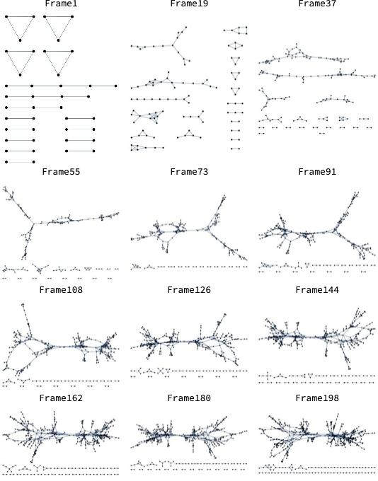

# Mitochondria plant social networks

[](https://zenodo.org/badge/latestdoi/290777516)

Retrive a local copy with

```sh
git clone https://github.com/StochasticBiology/plant-mitochondria.git
```

## Requirements

Note: we are currently refactoring this code to (a) remove dependence on proprietary software and (b) streamline the analysis. R code in `refactor/` replaces both bash+C code for network construction and Mathematica notebooks for network analysis and visualisation. It needs R with igraph and brainGraph packages. Using this code alone one should be able to take TrackMate trajectories (output as XML) and construct and analyse encounter network statistics. This refactoring is ongoing; please contact us if you have particular priorities! The following holds for the code outside `refactor/`.

Before running, ensure you have access to:
- Wolfram Mathematica (version 11.3.0.0 used here)
- Fiji (ImageJ) version 2.0.0-rc-69/1.52n with trackmate plugin
- R (Version 4.0.1 or later)
  - Required packages:
    - ggplot2
    - jpeg
    - cowplot
    - gridExtra
    - ggpubr
    - magick
    - ggdark
    - ggthemes
    - svglite
    - methods
    - sp
    - dplyr
    - vioplot
    
## Simulation of mitochondrial motion

To run the model code (as defined by [physnew-28-11-19.c](PIPELINE/physnew-28-11-19.c)), with chosen parameterisations, *followed by* frame time (ie frame interaval), video resolution, frame number and colocalisation distance as input variables:
```sh
cd PIPELINE
./automatedSimulationRun.sh NCYT NMITO EDGELOSS CYTDIST CYTATTACH CYTDETACH CYTSPEED MITDIST MITSPEED STEPTYPE STEPPARAM HYDRO RSEED FrameTime Resolution FrameNumber ColocDistance
```
Ensure correct formatting of input variables. For example:
```sh
cd PIPELINE
./automatedSimulationRun.sh 3 111 0.050 2.166 0.000 0.216 4.581 3.472 0.884 0 0.762 0.162 0 1.1628 1.000 198 1.6
```
This script also runs `masterSSGeneration.sh` so analyses the output, generating a file named ./PIPELINE/simulations/3_111_0.050_2.166_0.000_0.216_4.581_3.472_0.884_0_0.762_0.162_0 full of summary statistics lists, images, and graphs.


This example will, among other summary statistics outputs, provide network images such as:



## Analysis of experimental data

Uses the same master script `masterSSGeneration.sh` as simulation analysis, with formatting of data neccessary beforehand

If trackmate  is your chosen tracking software (all tracks to XML option), output needs running through `parse.sh` to be reformatted. 

```sh
./parse.sh trackmatefile.xml
```

Giving a **tab-delimited** data table formatted as:
|	|Trajectory|Frame|x|y|z|m0|	m1|	m2|	m3|	m4|	NPscore|
| --- | --- | --- | --- |---|---|----|---|---|---|---|---| 
| 1	| 1	| 0	| 24.052869 |	23.718501|	0|	0|	0|	0|	0|	0|	0|
| 2	| 1	| 1	| 24.305913 |	23.714648|	0|	0|	0|	0|	0|	0|	0|
| 3	| 1	| 2	| 24.356292 |	23.565736|	0|	0|	0|	0|	0|	0|	0|
|...| ...|...|... |...|...|...|...|...|...|...|...|
| n index  | n trajectory | n frame | final x coordinate |	final y coordinate|	0|	0|	0|	0|	0| 0| 0| 

This needs to be the format regardless of tracking software used.

**Move** this .xml.csv file into a directory named ./PIPELINE/namedSubfolder/videoIndentifier  

Run this .xml.csv output file through `masterSSGeneration.sh` with the following input variable format 

```sh
./masterSSGeneration.sh ./PIPELINE/namedSubfolder/ videoIndentifier trackmatefile.xml.csv frameTime Resolution frameNumber colocalisationDistance
```

For example, for:
- a videoIntentifier of **VideoA**, 
- a trackmate file named **trackmateVideoA.xml.csv**
- a frame time of **1.5** seconds, 
- a resolution of **1** (if using trackmate this resolution will be 1, as the software recognises resolution upon input, but for any other software you'll need to input resolution in pixels per micron)
- a frameNumber of **118**
- a colocalisation distance of **1.6** microns


This input will look like:

```sh
./masterSSGeneration.sh ./PIPELINE/videoAfolder/ VideoA trackmateVideoA.xml.csv 1.5000 1.0000 118 1.6
```
**Note**: Before this is run, trackmateVideoA.xml.csv will be need to be within the directory ./PIPELINE/videoAfolder/VideoA

This will give you the ./PIPELINE/videoAfolder/VideoA full of summary statistics lists, images, and graphs. 

### GIF and PDF of traces generation

This uses two files: one for generating gifs from simulation data, one for generating gifs from experimental data. 
This is due to cytoskeletal strands being added to simulation gifs.
**Note** This is the format most files in the `masterSSGeneration.sh` run as, in the format `./script directory simIdentifier simutputFile.txt frameInterval resolution frameNumber colocalisationDistance`

For simulation, example: 

```sh
./visualise2forsim.sh ./PIPELINE/simulations/ 3_111_0.050_2.166_0.000_0.216_4.581_3.472_0.884_0_0.762_0.162_0 simoutput-3-111-0.050-2.166-0.000-0.216-4.581-3.472-0.884-0-0.762-0.162-0.txt 1.1628 1.000 198 1.6
```
For experimental data, example:
```sh
./visualise2forvideosfromtrackmate.sh ./PIPELINE/videoAfolder/ VideoA trackmateVideoA.xml.csv 1.5000 1.0000 118 1.6
```

### Summary Statistics table generation, and trellis plot figures

Statistics gathering from all appropriate files begins with running:

`namesOfDirectories-spreadsheetCuration.sh`
Looks in all specified directories for appropriate files. Need to alter the appropriate files depending on how many videos being analysed. Generates OriginDirectoriesTable.txt

Proceed to run the below scripts to get information on filename, pathname and number of lines in each file, again ensure each script has appropriate file names being searched.  

`namesOfFiles-spreadsheetCuration.sh`   (All of these output files from these scripts should have same number of lines)

`numberOfLines-spreadsheetCuration.sh`  (tells you how many of each file you have. The output for each wc should be the same)

`namesOfPaths-spreadsheetCuration.sh`  (All of these output files from these scripts should have same number of lines)


Once those files have been checked, run  these: 

`statisticsLists-spreadsheetCuration-earlyFrame.sh`
`statisticsLists-spreadsheetCuration-MiddleFrame.sh`
`statisticsLists-spreadsheetCuration-FinalFrame.sh`

Then use the output of those files to go thorough, making sure to alter identifiers as needed for video and simulation


`AutomatedSpreadsheetGeneration.r`  (change inputs and outputs depending on early/mid/late data)
`limitedTrellisPlotting-earlypoint.r` (early)
`limitedTrellisPlotting-midpoint.r` (mid)
`limitedTrellisPlotting.r` (late)

